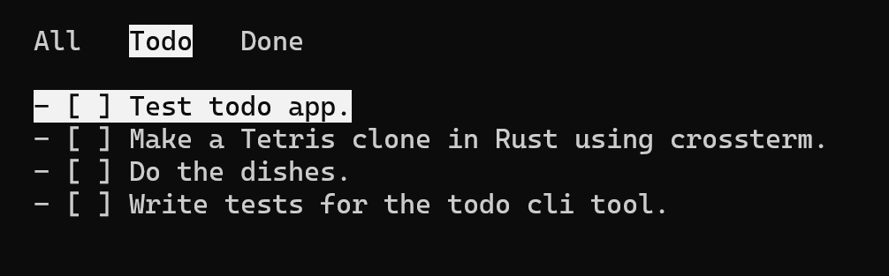

# Todo.rs
An interactive Todo list CLI tool written in Rust.

## Installation

```bash
git clone https://github.com/joeymalvinni/todo.git
```

Install `crossterm` using `cargo install crossterm`.
Run using `cargo run`.

## Todo

- [ ] Edit existing list item using 'i'
- [ ] Move around in insert mode using Left and Right arrow keys
- [ ] Settings edit to use unicode or markdown
- [ ] Colors (?)
- [ ] Change tab using 'h' and 'l' for left and right
- [x] Mark as done/todo using 'x'
- [x] Append new item using 'a'
- [x] Save edits on quit
